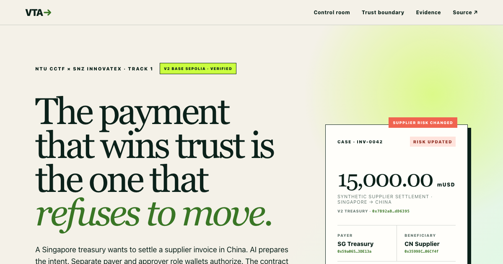

# Verifiable Treasury Agent V2

Track 1 prototype for NTU CCTF × SNZ InnovateX 2026: an AI-orchestrated treasury workflow whose authorization, approvals, policy checks, escrow, release, refund, and reconciliation are enforced by an auditable smart contract.

**Live demo:** https://oxygen56.github.io/verifiable-treasury-agent/

**Public repository:** https://github.com/Oxygen56/verifiable-treasury-agent

**Devpost:** https://devpost.com/software/verifiable-treasury-agent

**Two-minute narrated walkthrough:** [`output/video/verifiable-treasury-agent-v2-demo.mp4`](output/video/verifiable-treasury-agent-v2-demo.mp4)



## The problem

An AI can explain why a cross-border payment looks safe, but its prose is not authorization and cannot prove that treasury limits, separated approvals, sanctions controls, or recovery paths actually ran. V2 separates convenient orchestration from enforceable authority: the AI produces an unsigned plan, the payer signs the exact intent, separate role wallets attest and approve it, and the contract alone controls settlement state and escrowed value.

The first intended user is a regional treasury lead preparing a supplier payment that may cross jurisdictions. Their concrete job is not simply “send tokens”; it is to turn an invoice into an approved instruction, detect a policy change before release, recover blocked funds, and hand finance an exact reconciliation trail. A production pilot would measure approval lead time, stale-policy blocks, recovery time, reconciliation exceptions, and operator interventions. No pilot or savings claim is asserted by this prototype.

## What makes V2 different

- **AI cannot authorize a transfer.** The payer signs an EIP-712 intent binding the beneficiary, amount, route, quote, clearance, invoice commitment, order ID, expiry, and nonce. Anyone may relay it, but tampering or replay fails on-chain.
- **Role separation survives role churn.** Payer, beneficiary, administrator, operator, approver, and compliance role-wallet addresses cannot overlap. High-value settlements require two distinct approver addresses; membership epochs stop revoke-and-regrant from reviving old approvals or credentials.
- **Compliance fails closed.** Both payer and beneficiary need current risk attestations. A sanctions flag blocks release immediately; clearing that flag requires two distinct, currently authorized compliance-role wallet addresses. Clean attestations expire after seven days.
- **Clearance is exact and revocable.** Append-only credentials bind payer, beneficiary, route, policy, amount ceiling, validity, issuer epoch, and risk epochs. They track lifetime consumption and support precise revocation.
- **Privacy claims are testable and narrow.** Raw invoice and KYC records stay off-chain. A domain-separated salted commitment binds the invoice to this chain, contract, payer, beneficiary, amount, route, and order. Authorized disclosure recomputes the commitment; this is selective disclosure, not zero-knowledge privacy.
- **The failure path is a first-class demo.** The challenge clock starts only after funding. A post-funding synthetic sanctions update produces a real Base Sepolia transaction with `status 0`; escrow remains intact, then cancellation returns the full amount to the payer.
- **Accounting is explicit.** Exact token balance deltas reject fee-on-transfer assets. `totalEscrowed`, lifetime clearance consumption, terminal states, and final balances reconcile; the public run ends with zero escrow and `solvent = true`.

## Why this is more than an AI wallet or multisig

| Control question | Typical AI wallet | Typical multisig / escrow | Verifiable Treasury Agent V2 |
| --- | --- | --- | --- |
| Can model output move value? | Often coupled to a signer or execution tool | Model usually outside the control boundary | No; planner has no signer, provider, wallet, or transaction transport |
| What exactly did the payer authorize? | Prompt or opaque tool call | Often a transaction hash | Typed EIP-712 intent binds parties, amount, route, quote, clearance, order, expiry, and nonce |
| What if risk changes after funding? | Usually not rechecked | Threshold approval may already be final | Release rechecks current payer/beneficiary risk and live approval epochs |
| Can a failed release be proven and recovered? | Common demos show only success | Recovery varies by implementation | Public `status 0` receipt, unchanged escrow, full refund, and zero-liability reconciliation |
| What may AI do? | Decide and execute | Explain around a manual flow | Explain and orchestrate an unsigned plan; deterministic checks and human-controlled keys remain authoritative |

## Public Base Sepolia proof

The V2 manifest records 26 public transaction receipts across two outcomes using separate test-only identities:

| Scenario | Public result |
| --- | --- |
| Clean settlement | Separate payer and beneficiary role wallets, payer-signed intent, two approvals, funded escrow, then 15,000 mUSD released |
| Sanctions rollback | Distinct beneficiary is flagged after funding; release receipt has `status 0`; payer cancels and receives the full 15,000 mUSD refund |
| Final reconciliation | Payer 15,000 mUSD; clean beneficiary 15,000 mUSD; blocked beneficiary 0; escrow 0; `totalEscrowed = 0`; solvent |

- V2 treasury: [`0x7B92aB3D8BA17cF5f28C60E5c1FC326862dD6395`](https://sepolia.basescan.org/address/0x7B92aB3D8BA17cF5f28C60E5c1FC326862dD6395)
- Demo token: [`0x2254a6A25f3284faaF79522bc1162743e0c39157`](https://sepolia.basescan.org/address/0x2254a6A25f3284faaF79522bc1162743e0c39157)
- Clean release: [`0xb1d2be7a…fa3d43`](https://sepolia.basescan.org/tx/0xb1d2be7aee2381be2c7e7040b44eb669b36c656cc7bc14e83b7e161a16fa3d43)
- Failed release after sanctions update: [`0xf4be9274…31f8db`](https://sepolia.basescan.org/tx/0xf4be9274fc867ae0efea504966649f37bbce6dfcbb797c92ec0ce3f22031f8db)
- Full refund: [`0x251b3f96…3b6b07`](https://sepolia.basescan.org/tx/0x251b3f969c6dedc06dbbe84866717511c26220f80f53e17e3065945753236b07)
- Complete manifest: [`evidence/base-sepolia-v2.json`](evidence/base-sepolia-v2.json)

**mUSD is a project-deployed, valueless test token. It is not USDC and is not backed by fiat.** The SG → CN corridor, invoice, KYC/risk facts, sanctions change, and FX/off-ramp story are synthetic. This run is not a real cross-border or production settlement.

## Reproduce locally

```bash
pnpm install --frozen-lockfile
pnpm check
pnpm coverage
```

Run the deterministic, offline V2 planner with the synthetic sample invoice:

```bash
node scripts/plan-settlement-v2.js evidence/sample-invoice-v2.json
```

The planner emits an unsigned EIP-712 plan and contains no signer, wallet, provider, contract call, or transaction transport. Serve the judge-facing evidence replay locally with:

```bash
pnpm demo
```

Then open `http://localhost:4173/demo/`. The static interface reads the committed public manifest; it does not connect a wallet or broadcast a transaction.

## Verification record

- **37 repository-wide passing checks:** 30 current V2 contract/state-path/planner checks plus 7 retained historical V1 controls. The V2-only judge bundle reproduces the 30 current checks.
- **64 deterministic generated state paths** checking solvency, exact conservation, nonce monotonicity, and single terminal outcome. This is not a formal proof or a full fuzzing campaign.
- **V2 coverage:** 98.84% statements, 94.44% functions, and 99.14% lines; branch coverage is 45.45%.
- **Slither triage:** 26 contracts, 63 detectors, and zero findings in the filtered high/medium scan after documented triage. This is not an independent security audit.
- **Deployability:** 22,427-byte runtime, 2,149 bytes below the EIP-170 limit.
- **Bytecode evidence:** the locally compiled and on-chain runtimes are both 22,427 bytes and have the same hash after normalizing the compiler-declared immutable slots. This is not third-party explorer source verification.
- **Public execution metrics:** all 26 receipts consumed 9,303,697 gas and 0.000055950883453125 test ETH over a 736-second first-to-last block span. The median observed confirmation latency is 7.499 seconds for the nine transactions whose client-side timing was retained; it is not a 26-transaction latency sample.
- **Real Codex boundary run:** a read-only Codex CLI invocation using the CLI-reported `gpt-5.6-sol` model explained the deterministic synthetic plan into a strict JSON schema in 27.432 seconds. It returned `UNSIGNED_REVIEW_REQUIRED`, named the stop conditions, performed no requested tools/signing/broadcast/state change, and reported 20,878 tokens; no metered API cost was exposed.

The recorded commands and outputs are under [`experiments/runs/`](experiments/runs/). The public receipts and reconciled state are independently inspectable on Base Sepolia.

## Repository map

- [`contracts/VerifiableTreasuryV2.sol`](contracts/VerifiableTreasuryV2.sol) — hardened EIP-712 settlement and policy state machine
- [`src/orchestrator-v2.js`](src/orchestrator-v2.js) — deterministic AI-safe planning boundary
- [`test/VerifiableTreasuryV2.test.js`](test/VerifiableTreasuryV2.test.js) — V2 security and behavior controls
- [`test/VerifiableTreasuryV2.invariants.test.js`](test/VerifiableTreasuryV2.invariants.test.js) — deterministic multi-path conservation checks
- [`test/orchestrator-v2.test.js`](test/orchestrator-v2.test.js) — contract/planner hash equivalence and no-authority checks
- [`scripts/verify-base-sepolia-v2-evidence.js`](scripts/verify-base-sepolia-v2-evidence.js) — read-only receipt and state verifier
- [`evidence/codex-explanation-v2.json`](evidence/codex-explanation-v2.json) — real, schema-constrained Codex explanation-only trace and claim boundary
- [`demo/`](demo/) — judge-facing evidence replay
- [`output/video/verifiable-treasury-agent-v2-demo.mp4`](output/video/verifiable-treasury-agent-v2-demo.mp4) — 114.9-second narrated V2 evidence walkthrough
- [`docs/ARCHITECTURE.md`](docs/ARCHITECTURE.md) — trust boundary, controls, and state transitions
- [`DISCLOSURE.md`](DISCLOSURE.md) — prior work, AI, dependency, data, and evidence disclosure
- [`SUBMISSION.md`](SUBMISSION.md) — Devpost-ready story and three-minute demo path

## Evidence boundary

V2 is a public-testnet prototype, not audited production infrastructure. It does not provide a certified sanctions feed, KYC provider, fiat custody, FX execution, off-ramp, regulatory approval, production key management, or real-funds safety. Administration is still a test EOA rather than a production multisig. Revocability ends at release; final blockchain transfers are not reversed by this contract.

V1 remains in the repository as historical state-machine evidence. Its public proof used the same wallet as payer and beneficiary and must not be read as separate-role settlement evidence. V2 is the current architecture and the only public run used for the claims above. The public run proves distinct role addresses, not that each address was controlled by a different human.

Apache-2.0 licensed. See [LICENSE](LICENSE).
