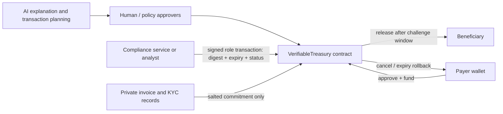
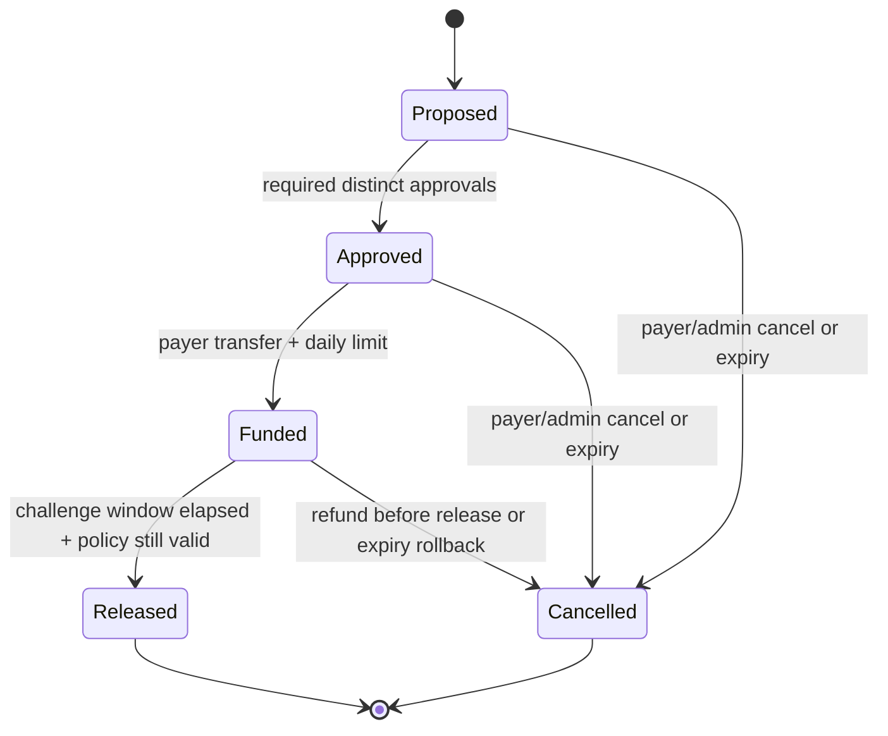

# Architecture and trust boundary

## System boundary

The AI has no privileged role. It may explain a settlement, prepare unsigned call data, or sequence user-approved operations. It cannot bypass contract checks or mutate settlement state without a valid transaction from an authorized account.

## State machine

## Controls

| Risk | Enforced control | Evidence |
| --- | --- | --- |
| Excess treasury spend | Per-payer daily funding limit | Reverting negative test; unchanged balances/state |
| Single-person high-value action | Two distinct approvers at/above threshold | Duplicate approval rejected |
| Sanctioned beneficiary | Current clearance must be non-sanctioned | Approval/release reverts if status changes |
| Stale policy | Proposal binds exact policy digest and expiry | Policy-mismatch release test |
| Sensitive invoice leakage | Salted commitment on-chain, raw data off-chain | Selective disclosure view check |
| Wrong bank details / fraud discovered | Pre-release cancellation refunds escrow | Balance reconciliation test |
| Stuck settlement | Permissionless expiry rollback | Escrow returns to payer |
| AI hallucination | Core transition rules contain no model call | Solidity source + tests |

## Honest limitations

- The contract consumes compliance attestations; it does not itself download or certify official sanctions lists.
- Hash commitments hide content only when inputs include adequate entropy and the raw records remain securely stored off-chain.
- Cancellation is available before release. Released blockchain transfers are final unless a separate recipient-authorized return occurs.
- Contract tests and a public testnet deployment do not establish production security. Independent audit, key management, legal review, and operational controls remain required.
