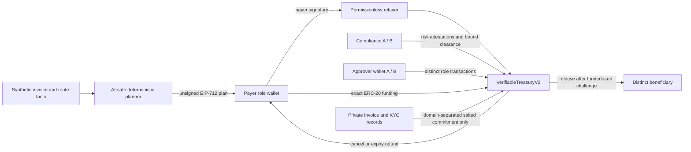
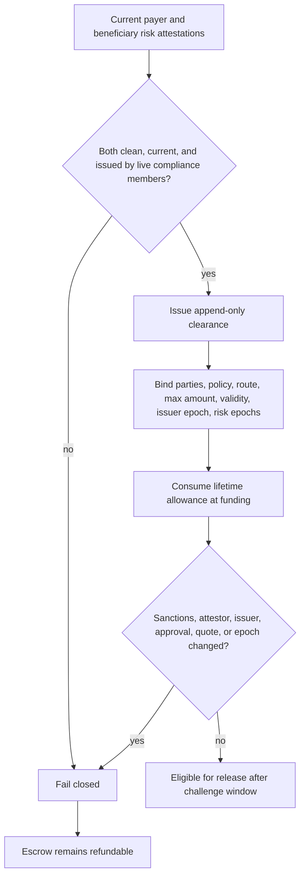
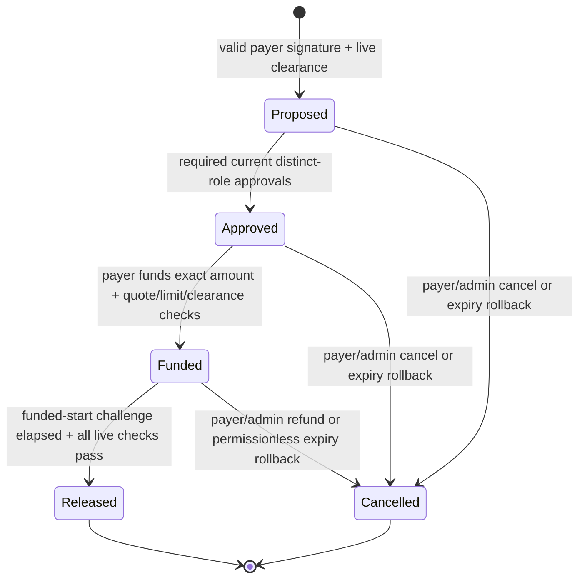

# V2 architecture and trust boundary

## Design rule

AI may interpret a synthetic invoice, explain policy requirements, and prepare an unsigned settlement intent. It has no privileged role, private key, signer, provider, contract call, or transaction transport. Authority starts with the payer's EIP-712 signature and every value-moving state transition is checked by `VerifiableTreasuryV2`.

## Authority separation

| Actor | Can do | Cannot do |
| --- | --- | --- |
| AI/planner | Validate inputs, compute commitment and typed-data digest, explain next steps | Sign, approve, attest risk, fund, release, cancel, or broadcast |
| Payer | Sign exact intent, fund approved escrow, invalidate nonces, reset stale approvals, cancel before release | Self-approve or act as admin/operator/compliance |
| Relayer | Submit an unchanged payer-signed intent | Change any signed field or create payer authority |
| Approver | Approve within the current approval round and membership epoch | Be payer, beneficiary, admin, operator, or compliance; approve twice |
| Compliance | Attest current payer/beneficiary risk and issue exact clearance | Be a settlement participant; clear a sanctions flag alone |
| Administrator | Grant separated roles, pause, revoke a clearance, or cancel | In V2, automatically receive any business role |
| Contract | Verify every gate, escrow exact token amount, release or refund atomically | Fetch or certify external KYC, sanctions, FX, custody, or off-ramp facts |

The constructor grants only the administrator role. Governance, operator, approver, and compliance identities are mutually exclusive. Approver and compliance membership epochs change on grant and revoke, so removing and re-adding the same address cannot reactivate an old approval, clearance issuer, risk attestation, or first risk-clear vote.

## Signed intent and replay boundary

The payer signs an EIP-712 `SettlementIntent` containing:

- payer, beneficiary, amount;
- settlement expiry and quote expiry;
- clearance ID;
- invoice commitment, policy digest, corridor digest, and quote digest;
- payer-scoped client order ID and monotonic nonce.

The contract rejects a modified signature, stale or skipped nonce, repeated client order, or repeated invoice commitment for the same payer. The invoice commitment is separately domain-bound to its version tag, chain, contract, payer, beneficiary, amount, route, order, invoice bytes, and salt. The on-chain commitment does not prove that off-chain facts are true; it proves which exact private preimage was bound if the holder later discloses it.

## Compliance credential lifecycle

Clean risk attestations are usable for at most seven days. A single current compliance-role wallet can flag a payer or beneficiary because blocking should fail closed. Reversing a sanctions flag requires one compliance-role wallet to propose and a second, distinct, currently authorized compliance-role wallet to confirm the same evidence. Re-attestation invalidates an outstanding clear proposal. These are separate on-chain addresses; the public proof does not establish separate human controllers.

Each clearance is append-only and can be precisely revoked. It binds a specific payer-beneficiary-route-policy tuple, maximum lifetime amount, validity, issuer membership epoch, and both risk epochs. Consumption increases only on successful funding and is returned on refund.

## Settlement state machine

The challenge window is calculated from `fundedAt`, not proposal time, so delayed review or approval cannot consume the protection period. Release rechecks the payer and beneficiary risk records, clearance and issuer epochs, approval membership epochs, route/policy binding, settlement expiry, and solvency-sensitive accounting. A revert changes no settlement state or token balance.

## Accounting invariants

| Invariant | Mechanism | Evidence |
| --- | --- | --- |
| No underfunded ledger entry | Pre/post contract balance delta must equal the declared amount | Fee-on-transfer asset negative test |
| Escrow remains solvent | `token.balanceOf(contract) >= totalEscrowed` | Local multi-path checks and public final state |
| One terminal outcome | Settlement ends `Released` or `Cancelled`, never both | 64 deterministic generated state paths |
| Exact conservation | Funding, release, refund, and clearance consumption reconcile | Concurrent release/cancel/expiry test and public manifest |
| No stale approval revival | Approval round plus membership epoch checked at funding and release | Revoke/re-grant negative test |
| No stale risk credential | Seven-day freshness plus compliance and risk epochs | Stale-attestation and role-revocation tests |

The public Base Sepolia run demonstrates two terminal paths with 26 receipts: one clean 15,000 mUSD release to a beneficiary distinct from the payer, and one funded settlement where a synthetic sanctions update makes release fail with transaction `status 0`, followed by a full refund. Final escrow and `totalEscrowed` are zero and `solvent` is true.

## Evidence quality

- 40 repository-wide checks pass: 33 current V2 contract/state-path/planner/live-verifier checks plus 7 retained historical V1 controls. The V2-only judge bundle reproduces the 33 current checks.
- The V2 contract has 98.84% statement, 94.44% function, 99.14% line, and 45.45% branch coverage.
- A filtered Slither high/medium triage analyzed 26 contracts with 63 detectors and reported zero findings. This is not an independent audit.
- The deployed runtime is 22,427 bytes, below EIP-170 by 2,149 bytes.
- The local and Base Sepolia runtimes have the same normalized hash after compiler-declared immutable slots are zeroed. Blockscout also publishes the standard-JSON source and reports verified/partial matching with unchanged bytecode, but not full verification.

The 64 generated paths are deterministic stateful regression checks, not a formal verification result or an exhaustive fuzzing proof.

## Honest limitations

- The public asset is a project-deployed, valueless mUSD token, not USDC or fiat-backed money.
- SG → CN, invoices, risk/KYC facts, sanctions changes, FX, and off-ramp behavior are synthetic. No real cross-border payment occurred.
- The contract consumes compliance evidence digests; it does not fetch or certify official sanctions lists or identity records.
- Salted commitments require high-entropy salts and secure off-chain storage. They provide selective disclosure, not zero-knowledge privacy or guaranteed secrecy.
- Cancellation and expiry rollback apply only before release. A released blockchain transfer is final unless the recipient separately returns it.
- The administrator is a test EOA. Production use requires multisig governance, hardened key custody, independent audit, monitoring, legal review, regulated partners, and incident procedures.
- V1's public run used the same wallet as payer and beneficiary. It remains historical state-machine evidence only; V2 supplies the separate-role-address public proof. The public run does not prove that each wallet was controlled by a different human.
